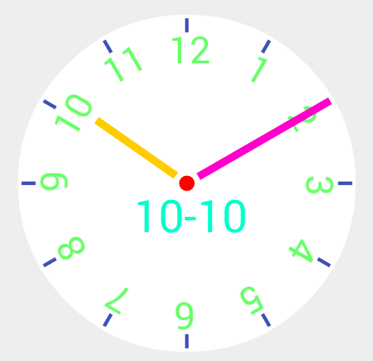

# TimePickView
TimePickView for android
##Usage

###Adding Library

you just add the following dependency to your build.gradle:

```groovy 
 dependencies {  
    repositories {
        mavenCentral()
    }
    compile 'com.anwios.android:timepickview:1.0.1'
  }
```

### example codes
```xml 
 <com.anwios.android.views.TimePickView
        android:id="@+id/tpv"
        android:layout_width="wrap_content"
        android:layout_height="0dp"
        android:layout_weight="1"/>
```

```xml 

 <com.anwios.android.views.TimePickView
        android:id="@+id/mv"
        android:layout_width="wrap_content"
        android:layout_height="0dp"
        android:layout_weight="1"
        app:tpv_textSize="48sp"
        app:tpv_hourTextSize="40sp"
        app:tpv_minuteHandWidth="8dp"
        app:tpv_hourHandWidth="8dp"
        app:tpv_minuteHandColor="#FF00cc"
        app:tpv_hourHandColor="#FFcc00"
        app:tpv_textColor="#00ffcc"
        app:tpv_hourMarkerSize="15dp"
        app:tpv_hourMarkerWidth="4dp"
        app:tpv_hourTextColor="#66ff66"
        app:tpv_centerPointColor="#ff0000"
        app:tpv_centerPointSize="8dp"
        />
```

 sample
 
 
## Contributions

Any contributions are welcome. 

## Developed By
* Nooh - <nooh64@gmail.com>

## License
This projected is licensed under the terms of the MIT license.